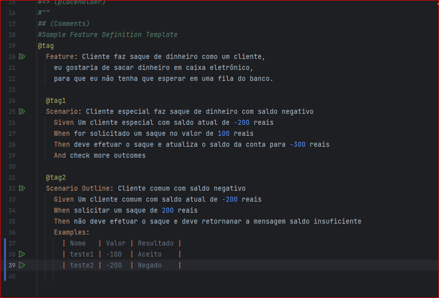
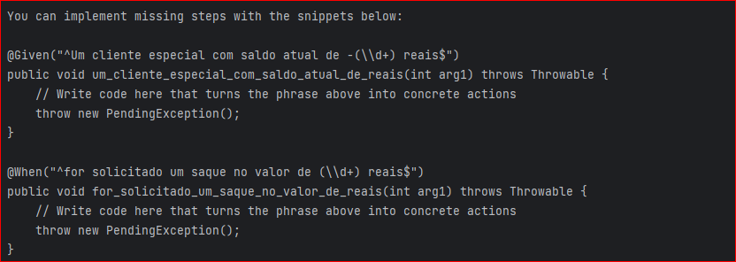
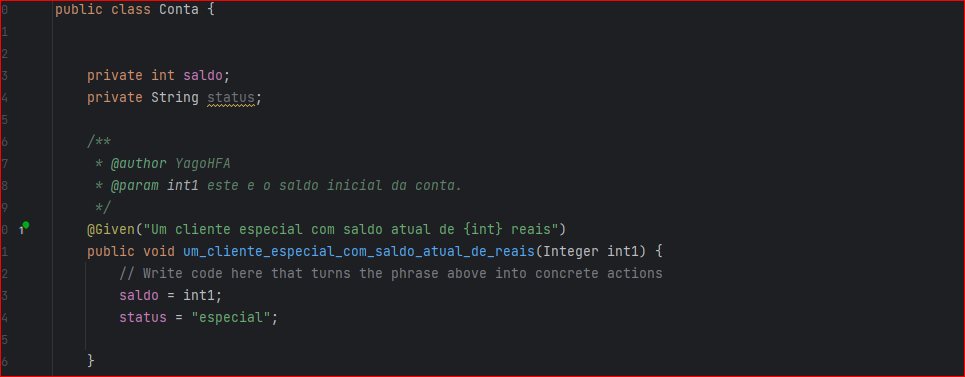
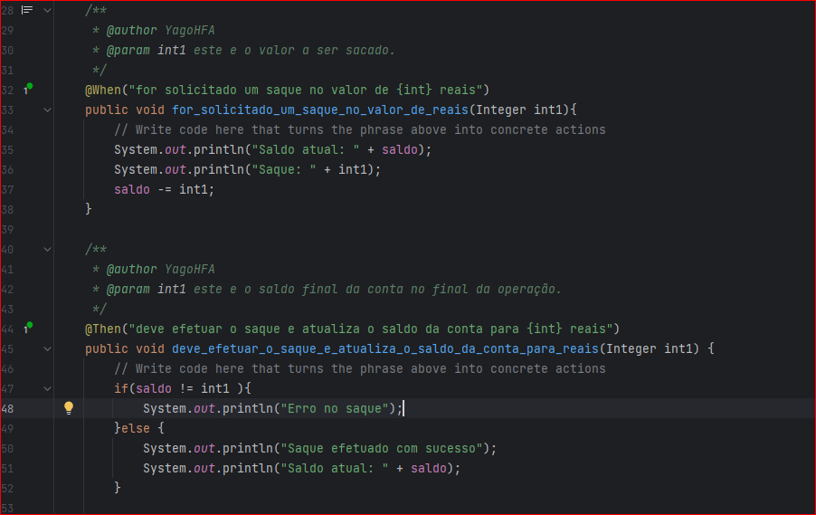
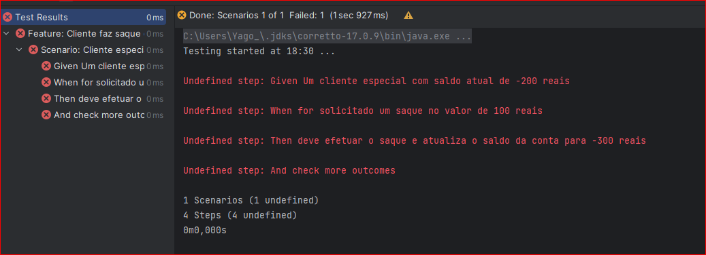
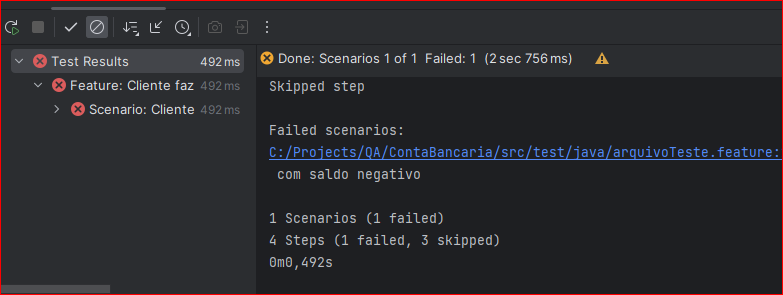
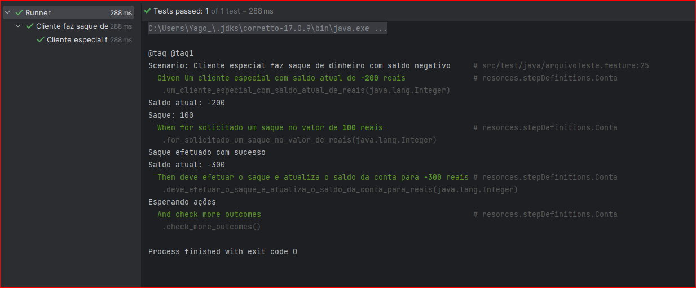
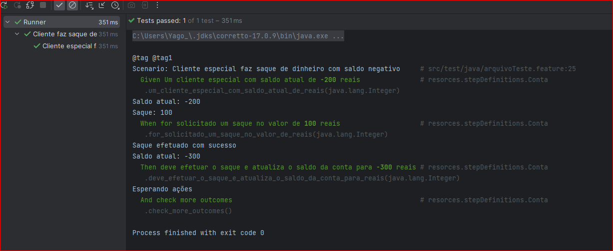
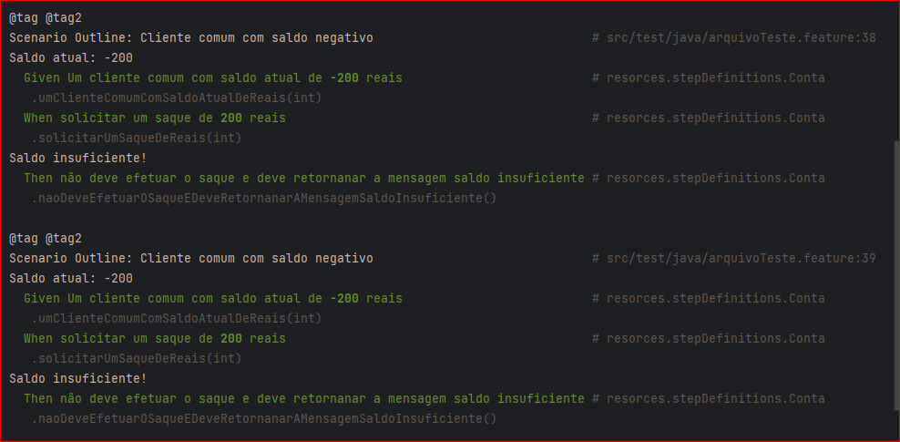
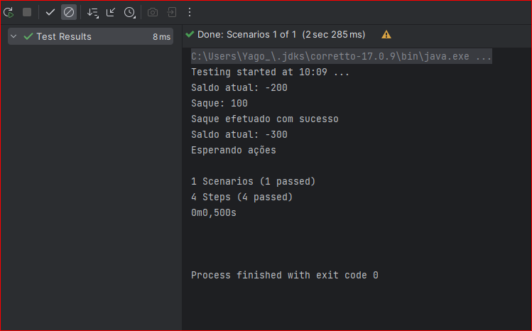

# Teste de Conta Bancaria com Cucumber

## Criando o aquivo feature para criação dos cenarios

## Métodos Cucumber

Ao excecutar o arquivo o Cucumbe ira retornar alguns métodos
a serem implementados, para que as etapas possam ser executadas.

## Criando a classe Conta com os métodos Cucumber

 Foi criado a classe Conta para realizar os testes de cenarios. 

## Testes

    Primeiro teste onde as etapas não estão defidas.

Realizado o teste, onde os métodos são implmentados, 
mas não realizão nenhuma operação.

Testes realizados usando configuração Junit com a classe Runner.

    Testes realizados pela configuração do Cucumber.

